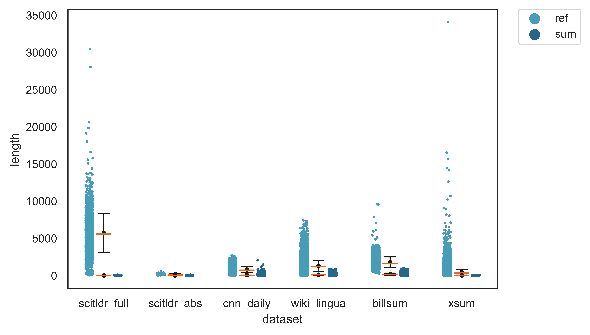
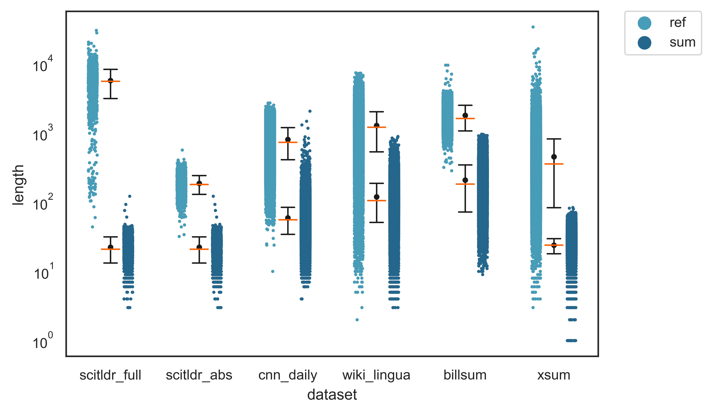
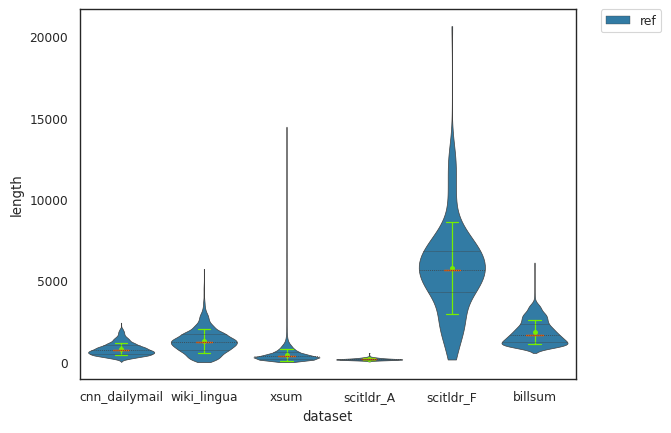
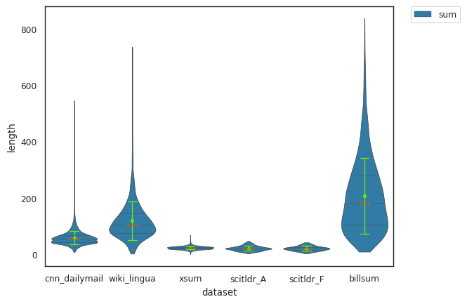
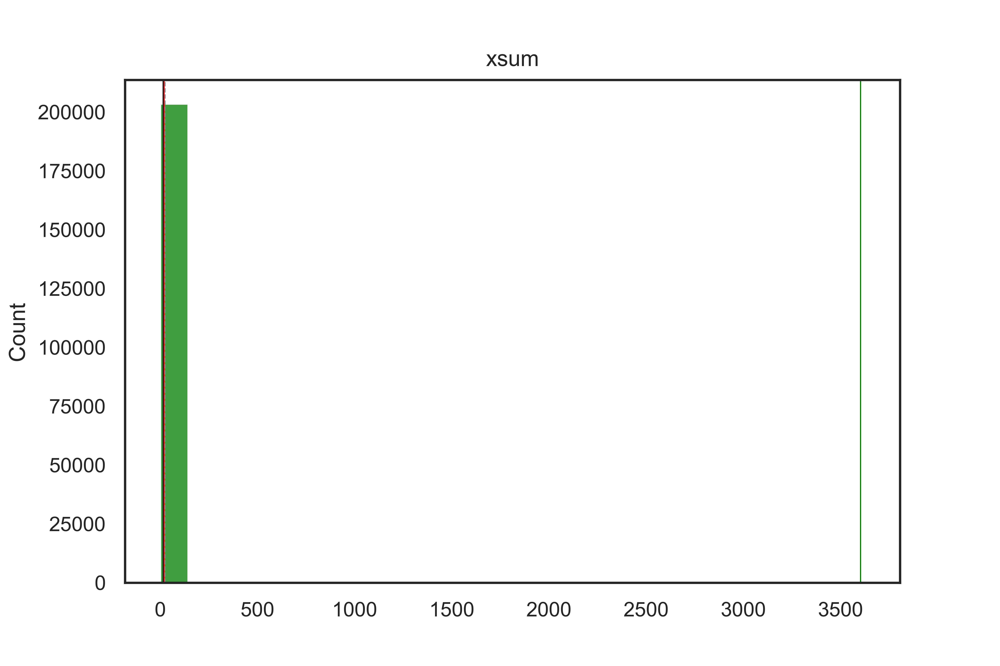
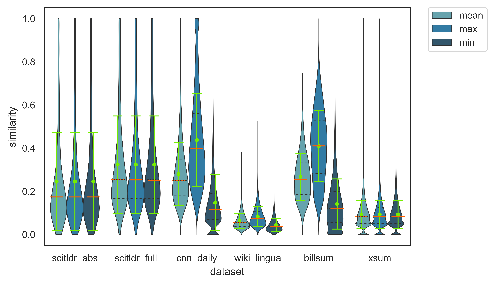
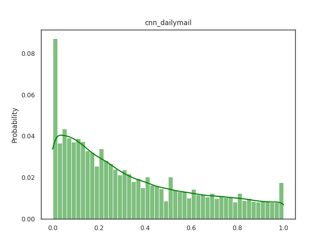
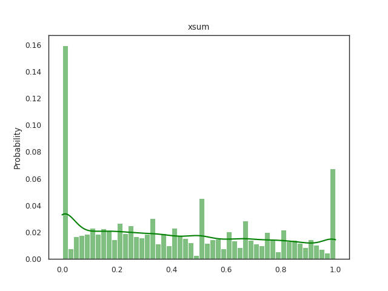

**Contents**

[[_TOC_]]

## 1 Library Description

### 1.1 Installation

To install the relevant external packages, please run `python3 -m pip install -r requirements.txt`.
In the case you are using some spacy-specific models, you may have to download additional dependencies by running `python3 -m spacy download en_core_web_sm` or `python3 -m spacy download en_core_web_md`.

## 1.2 Library usage

Our library is neatly packaged and users can use it easily, which also supports other datasets for English summarization. We have four dictionaries (`ds_name_list.json`, `ds_version_dict.json`, `source_names.json`, `target_names.json`) for you to add other dataset names and versions to download from `huggingface`, and you should also provide the source and target names to help the library rename features of the dataset you want to investigate.

The library mainly has four functionalities: preprocessing, inspection, plot and postprocessing. `LoadData.py` generalize the downloading and processing for datasets used in English summarization, which also removes all empty samples for more accurate research. In addition, you can have a fast investigation with a small proportion of data randomly selected from the dataset. 

If you want the exact values of some statistic, call `generate_stats.py` with different arguments to select dataset and proportion of data to investigate. For instance, `python generate_stats.py -d xsum --stats length -t spacy -p 0.1` will print all length statistics for 10% data of `xsum` with Spacy tokenization method.

If you want plots of some statistic, call `generate_plot.py` with different arguments to generate all types of plot described above for all datasets in the dictionary. For instance, `python generate_plot.py --stats similarity -p 0.1` will provide all plots of similarity statistics for 10% data of each dataset.

Finally, the library also supports to remove samples whose compression ratio is less than 1.0, which are obviously invalid samples. 

## 2 Introduction

### 2.1 Motivation

The general goal of automatic text summarization is to generate a condensed text of the input document which describes the main message of this document. Our task is based on English texts. Totally, there are two different approaches for automatic summarization: extraction and abstraction. Thus, we want an exploratory analysis on multiple datasets used in English summarization, in order to investigate which method the human annotators tend to use in a certain one. What’s more, we are also interesetd in model limitations on these datasets. For example, some approaches based on sequence to sequence model has a limit on the input sequence length with up to 512 or 1024 tokens, meaning that it will crash on longer sentences. In this case, we may need a preprocessing like length reduction or some method can summarize a document separately for the dataset. Finally, we also want to compare some datasets used in English summarization.

### 2.2 Datasets

I select datasets on `huggingface` libraries from a broad spectrum of domains. In the aspect of news articles, I choose `cnn_dailymail` which supports both extractive and abstractive summarization, and `xsum` from BBC for abstractive summarization. For wiki articles, I choose English part of `wiki_lingua` which collects WikiHow articles for abstractive summarization. From the aspect of scientific articles, I select `scitldr` which contains both author-written scientific documents and expert-derived TLDRs. It's divided into two separate datasets as I investigate it as abstract and full text article independently. In addition, I prefer `billsum` which collects US Congressional and California state bills (proposed laws) for both extractive and abstractive summarization. They are all big datasets with high popularity and most of them are used for abstractive summarization.

## 3 Representative Samples

If the users want to have a quick interact with the samples in the dataset, we can start with some representative samples. I generate six types of samples with whitespace tokenization method according to the length statistics. Here length refers to the number of tokens of source/target in one sample. I obtain samples by the maximum length of source, the maximum length of target, the minimum length of source, the minimum length of target, the average length of both source and target, and the median length of both source and target. I use $`L_2`$ norm to compute the closest sample to mean or median values of sources and targets as follows.

```python
# reshape to compute closest values using l2 norm
src_tg_vectors = np.concatenate(
    (stats.src.lens.reshape(1, -1), stats.tg.lens.reshape(1, -1)), axis=0
)
mean_vector = np.array([[stats.src.mean], [stats.tg.mean]])
median_vector = np.array([[stats.src.median], [stats.tg.median]])
mean_idx = int(np.linalg.norm(src_tg_vectors - mean_vector, axis=0).argmin())
median_idx = int(np.linalg.norm(src_tg_vectors - median_vector, axis=0).argmin())
```

All the representative samples marked with length values can be found in my `Representative data samples` pages in `Wiki` repository. For almost all the investigated datasets above, I find that the extreme cases like minimum target and minimum source show evidence of invalid samples. In detail, part of the source is missing in some samples with the source length is much shorter than target length, or the same case occurs on the target where may only contains a period. Moreover, it’s also controversial in some samples in `billsum` that the target length example is extremely short which seems to ignore some critical points of the law and event. 

Additionally, the quality doesn’t seem to be quite excellent because there still exists newline symbols in the texts. Even in the same dataset (e.g. `cnn_dailymail`, `xsum`), some of samples keep the newline symbols, while some don’t. It’s hard to say whether to keep them or not because they may show evidence of article structure, meaning a new paragraph, bullets and lists, or subsections. But I think it’s better to keep consistent in the identical dataset.

Furthermore, I have some other interesting findings. For scientific articles in `scitldr`, the average length examples show that the target is like the title of a paper, while the summary of the minimum target examples is composed of critical labels of the paper. For law documents in `billsum`, the summary of a bill could be composed of summaries of each section or subsection.

## 4 Comparison of Document and Summary 

The exploratory analysis of the above six datasets is carried out with respect to two aspects: length and similarity.

### 4.1 Length

I generate length statistics with `Spacy` tokenization method which provides more accurate tokenization results. For each dataset, I collect data of the number of samples, the mean/median length and standard deviation of documents, the mean/median length and standard deviation of summaries. But note here, since plots of distribution of lengths are very similar between `whitespace` tokenization and `Spacy` tokenization, I only present you some results by `Spacy` tokenization below. Results of the two methods can be found in the `Length stats of article and summary` page in `Wiki` repository.

| Datasets | Num | Article<br>Mean | Article<br>Median | Article<br>STD | Summary<br>Mean | Summary<br>Median | Summary<br>STD | Ratio | 
| :------: | :------: | :------: | :------: | :------: | :------: | :------: | :------: | :------: | 
| CNN_daily | 287113 | 806.56 | 736.00 | 393.43 | 59.48 | 56.00 | 25.01 | 15.01 | 
| XSUM | 204017 | 454.66 | 359.00 | 370.96 | 23.97 | 24.00 | 5.91 | 19.93 | 
| wiki_lingua | 47267 | 1100.60 | 1042.00 | 641.28 | 100.04 | 88.00 | 58.79 | 12.97 | 
| scitldr_abs | 1992 | 158.73 | 154.50 | 47.69 | 19.27 | 18.00 | 7.71 | 9.68 | 
| scitldr_full | 1992 | 4982.55 | 4879.50 | 2238.26 | 19.27 | 18.00 | 7.71 | 301.53 | 
| billsum | 18949 | 1801.20 | 1632.00 | 724.72 | 209.37 | 183.00 | 137.00 | 13.21 |

The results have similar values to the lengths statistics in some published paper[^1]. In overall, the lengths of samples in `wiki_lingua`, full text of `scitldr` and `billsum` are extremely high, which may exceed the model limitation. 

In order to get more expressive comparisons, I generate different types of plots propagating various information of lengths distribution, which can be found in the `Plot of length stats` page in `Wiki` repository.  

 
<!--   -->
* Light blue: document, dark blue: summary; 
* Black dot and bar: mean and std;
* Orange line: median.

I use the strip plot to explore length difference between the document and summary, and compare all six datasets. From the non-log plot, we can see that the length difference between source and target of the full text scientific articles is extremely high. I guess it’s because the annotators only use critical labels or titles of sections and subsections to write the summary. For news articles, the source length of `cnn_dailymail` are shorter than that of `xsum`, while the summary length is longer. The strip plot can also clearly illustrate the outliers among `scitldr`, `billsum` and `xsum`, especially several extremely far away points among full text of `scitldr` and `xsum`. From the log-scale strip plot, we can conclude that for all six datasets, the mean values are very close to the median values. The standard deviations of `wiki_lingua`, summary length of `billsum` and the source length of `xsum` are really high.

 
<!--   -->
* Green dot and bar: mean and std; 
* Orange line: median.

The following is a violin plot which is quite useful to show the distribution of lengths of all datasets for document and summary respectively. Although the length difference among theses datasets is quite large, we can still know that all of them have most of lengths centered around the mean and median values for both document and summary. And the number of outliers is also small.

Finally, I use histograms to illustrate count distribution of compression ratios, which indicates the fraction ratio between document length and summary length. 

 
<!--    -->
* Red line: mean;
* Green line: maximum; 
* Black line: median;  
* Dashed gray: std.

For instance of the above figures, the `cnn_dailymail` and `xsum` news articles both have most of ratios concentrated around 20. In order to get more detailed values, I also generate a log-scale version of counts. The same phenomenon also exists on `billsum` and `wiki_lingua` datasets. However, it’s surprisingly shown in both abstract and full text figures of `scitldr` that ratios are distributed like a Gaussian distribution in a certain range.

### 4.2 Similarity

The similarity statistics are generated with the help of [Dennis](https://github.com/dennlinger/aspect-summaries) library. It computes fmeasure scores with 2-grams between reference document and reference summary. Part of relative codes are as follows.

```python
from summaries.aligners import RougeNAligner

aligner = RougeNAligner(n=n_gram, optimization_attribute="fmeasure", lang="en")

for sample in tqdm(dataset):
        m = []  # mean
        for aligned_sentence in aligner.extract_source_sentences(
            sample["target"], sample["source"]
        ):
            m.append(aligned_sentence.metric)
            pos.append(aligned_sentence.relative_position)
```

I collect the mean, maximum and minimum similarity among summaries of each sample. Then I compute the average and median value of all means, the average of all maximum values, the average of all minimum values, and the maximum/minimum value among all summaries. The below is a table of all fmeasure scores.

| Datasets | Mean | Median | STD | Max_Max | Min_Min | Mean_Max | Mean_Min | 
| :------: | :------: | :------: | :------: | :------: | :------: | :------: | :------: | 
| CNN_daily | 0.2798 | 0.2495 | 0.1425 | 1.0000 | 0.0000 | 0.4371 | 0.1476 | 
| XSUM | 0.0931 | 0.0833 | 0.0636 | 1.0000 | 0.0000 | 0.0932 | 0.0929 |
| wiki_lingua | 0.0626 | 0.0547 | 0.0353 | 0.5238 | 0.0000 | 0.0831 | 0.0434 |
| scitldr_abs | 0.2456 | 0.1739 | 0.2270 | 1.0000 | 0.0000 | 0.2456 | 0.2456 |
| scitldr_full | 0.3239 | 0.2540 | 0.2251 | 1.0000 | 0.0000 | 0.3239 | 0.3239 |
| billsum | 0.2670 | 0.2564 | 0.1077 | 1.0000 | 0.0000 | 0.4095 | 0.1413 |

Obviously, all similarity scores are relatively low, meaning that they match the description that they are used for abstractive summarization. It’s normal we have summaries that are same as sentences in the document or totally different from the source. But it’s quite interesting to see that the highest similarity score in `wiki_lingua` means only half overlap in the summary. For further comparison, I draw the distribution of these similarity scores with a violin plot.

 
<!--  -->

In each sample:
* Mean similarity of all summaries; 
* Max similarity of all summaries; 
* Min similarity of all summaries;
* Green dot and bar: mean and std; 
* Orange line: median.

We have the same distribution of the above three data in full text and abstract of `scitldr` and `xsum` dataset, indicating that there’s only one sentence in the summary of each sample. In general, the standard deviations are all quite high and  From the maximum similarity aspect, cnn and billsum seem to be supportive for extractive summarization. From the shape of violins, we could know that all similarity scores of these six datasets are not concentrated on the mean or median values and kind like spread out all over the range of [0,1].

 
<!-- ") ") -->

I'm also interested in which sentence or the location of sentence which is more likely to give the critical idea of the document, so that I make the probability histogram plot for relative position of the most similar sentence of summaries in one sample. For example the figures of news articles above, we can conclude that the beginning sentences are much more important than others. Particularly, the possibility that the annotators make use of the first few sentences in `xsum` is twice of that in `cnn_dailymail`, while the ending sentences in `xsum` nearly as important as the beginning sentences in `cnn_dailymail`. However, the penomenon of "summary at the beginning" is much more conspicuous in `scitldr`, with up to about 27% beginning summaries in both abstract and full text articles. And especially for the abstract, the summaries also highly refer to any other positions from the original document. Last but not the least, two other datasets seem to show different evidences of relative position. In the plot of `billsum`, we find that the data is nearly evenly distributed, which coincide with my conjecture that the annotators summarize the bills with titles or critical points of subsections. In the plot of `wiki_lingua`, it's surprising to view that the vast majority of summaries are chosen from the beginning, middle, and end of WikiHow articles. Other plots can be seen in the `Plot of distribution of relative position of most similar sentence in article` page in `Wiki` repository. 

## 5 Practical Insights

We also have an amusing discovery that there exists some empty strings in source or target of some datasets. Thus, we focus on one particular dataset with two different versions: `wiki_lingua` and `GEM/wiki_lingua`. They are all multi-lingua summarization datasets, while we only focus on the English data of them, and the later one is a benchmark dataset used in such summarization task. 

We find that there’re quite a large number of empty strings in `wiki_lingua` as the following cases. For instance, all columns can be empty, or there're contents indicating the summary but with no contents of the article, while the website links exist. So I search some of the urls for the empty samples and the result shows that part of them are valid, while part of them are not and with a warning - "We're sorry. This article is currently in quality review.". In other words, the reason may lie in the data loading script and missing articles on the English WikiHow website. In total, empty strings of each feature like "section_name", "document" and "summary" can take up to about 22.6%.

* 'section_name': [], 'document': [], 'summary': [], 'url': [......]
* 'section_name': [......], 'document': [], 'summary': [......]

Therefore, I compare it with the bechmark version `GEM/wiki_lingua` in order to look for some clues. At the beginning, I find that there're only 21 empty source samples in the GEM version. For other languages, there're 10 empty source samples in Spanish, 2 empty source samples in french and nearly no empty source samples in German. After about one month, I update the downloading data of English part of `GEM/wiki_lingua` and there's no empty samples any more. They update their github repository while there's no update of `wiki_lingua` for almost one year. I also test "url" of all the samples in `wiki_lingua`, which indicate that they are truly from WikiHow website. Nevertheless, there's no evidence of links for `GEM/wiki_lingua`, and it's claimed as collecting articles from WikiHow while with some samples not being found from English WikiHow website. So I read the paper[^2] which describe its data collection and I guess some of the samples are translated from wikihow of other languages by WikiHow expert. There’s still no answer why their contents seem to be different, although they are linked to the same paper and GitHub repository.

Additionally, I also make a comparison of the length statistics between these two datasets as shown in the table below. 

| Datasets | Num | Article<br>Mean | Article<br>Median | Article<br>STD | Summary<br>Mean | Summary<br>Median | Summary<br>STD | Ratio | 
| :------: | :------: | :------: | :------: | :------: | :------: | :------: | :------: | :------: | 
| wiki_lingua | 47260 | 1098.85 | 1040.00 | 640.71 | 98.02 | 85.00 | 58.31 | 13.31 | 
| GEM/wiki_lingua | 95517 | 379.68 | 340.00 | 224.30 | 32.23 | 28.00 | 19.05 | 14.11 |

The number of samples in `GEM/wiki_lingua` is about twice of that in `wiki_lingua`, while the article and summary length are around one third of that in `wiki_lingua`. However, they have close values of the ratio of document length over summary length at around 14.

## 6 Future Work

It might be usefull to explore the reason and meaning of newline symbols in the dataset. What's more, we can also design a rule or look for the threshold of whether to remove these newline symbols or not. Besides, we can research how to make use of them for summarization as well. 

## 7 References

[^1]: Narayan, Shashi ; Cohen, Shay B. ; Lapata, Mirella: Don’t Give Me the Details, Just the Summary! Topic-Aware Convolutional Neural Networks for Extreme Summarization. In: Proceedings of the 2018 Conference on Empirical Methods in Natural Language Processing. Brussels, Belgium: Association for Computational Linguistics, Oktober-November 2018, 1797–1807. Retrieved from: https://aclanthology.org/D18-1206.

[^2]: Ladhak, Faisal ; Durmus, Esin ; Cardie, Claire ; McKeown, Kathleen: WikiLingua: A New Benchmark Dataset for Cross-Lingual Abstractive Summarization.In: Findings of the Association for Computational Linguistics: EMNLP 2020. Online: Association for Computational Linguistics, November 2020, 4034–4048. Retrieved from: https://aclanthology.org/2020.findings-emnlp.360
